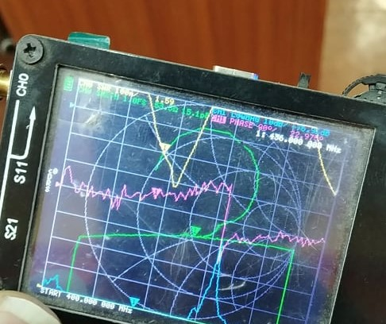

# Guide to Build a Yagi-Uda Antenna for Reception of SanoSat-1
In this document we will see how we can design a Yagi-uda antenna with readily available materials to recieve the data from SanoSat-1 which is a 1P PockeQube. [http://orionspace.com.np/sanosat-1/]
## Baisc Requirements
- Measuring Tape
- Aluminium Boom
- 50 Ohm SMA Connector
- RTL-SDR
- Nut and Bolts [M3]

## Optional Requirements
- SWR Meter

## Basics of Yagi-Uda Antenna
The main elements of a Yagi Uda antenna are Boom, dipole, directors and reflector. A boom is the long horizontal element that holds all other elements of the antenna. A dipole is the only element that is actually excited (that is a voltage or current is applied to it). A reflector is usually longer than the dipole element and the major role of the reflector is played by the first element next to the one energized and very little performance of a Yagi-Uda antenna is gained if more than one reflector is used. Similarly, the directors help to direct the electromagnetic waves in a particular direction making it more directive. Considerable improvements can be made by adding number of directors which also has a limit.

 \
A Yagi-Uda antenna basically consists of four parts
- Reflector
- Feeder Element [Radiator]
- Director
- Boom

## Procedure

- Follow the above diagram for dimensions and spacing of each elements and build the antenna.

Reflector Length [mm] : 331 \
Reflector Position [mm] : 0 

Dipole Length [mm] : 332 \
Dipole Position [mm] : 138 

Director Length [mm] : 308 \
Director Position [mm] : 275 

Director Length [mm] : 308 \
Director Position [mm] : 413 

Director Length [mm] : 308 \
Director Position [mm] : 550 

Director Length [mm] : 308 \
Director Position [mm] : 688 

- For the radiator part, cut the tape to half of 332mm and use a non-conductor example acrylic to seperate the radiator part with the boom [if the boom is metallic] and connect the parts with nut and bolt. Connect the transmission line to the radiator.
- Connect a RTL-SDR with the 50 ohm transmission line and connect the SDR with the USB port of your desktop/ laptop.
- Download SDRSharp and install in your system. https://airspy.com/download/
- Open SDRSharp, select RTL-SDR[USB] and tune to the right frequency 436 MHz and hit the play button after you connect the device to the USB.
- Now you can recieve the signals by tracking the antenna to the satellite.

If you have a SWRMeter, you can veiw the impedance and SWR of the antenna. I have used nanovna to measure the parameters. https://nanorfe.com/nanovna-v2.html The nanovna shows the SWR to be 1.59 with 53.5 Ohm impedance which seems good enough without matching so in order to make the build simpler, I did not use matching.

